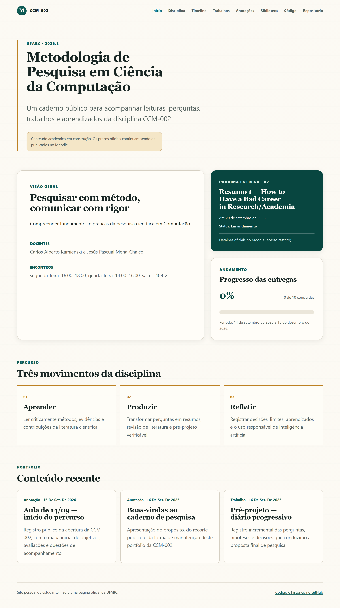

# CCM-002 — Metodologia de Pesquisa em Ciência da Computação

[](https://github.com/edupinhata/26Q3_research_methodology/actions/workflows/deploy-pages.yml)

Site público e portfólio acadêmico da disciplina **CCM-002 — Metodologia de Pesquisa em Ciência da Computação**, cursada na UFABC durante o quadrimestre 2026.3.

O projeto funciona como um caderno de pesquisa contemporâneo: reúne informações da disciplina, calendário, prazos, trabalhos, anotações e aprendizados de forma organizada, acessível e adequada para consulta pública.

> Este é um site pessoal de estudante, não uma página oficial da UFABC. O Moodle permanece como fonte oficial dos prazos e materiais restritos.

## Site publicado

A publicação pelo GitHub Pages está configurada para:

[https://edupinhata.github.io/26Q3_research_methodology/](https://edupinhata.github.io/26Q3_research_methodology/)

O deploy ocorre automaticamente após alterações na branch `main`, desde que os testes, a verificação de tipos, o build e os testes de acessibilidade sejam aprovados.

[](https://edupinhata.github.io/26Q3_research_methodology/)

A captura é gerada a partir do build de produção e funciona como atalho para o site publicado.

## Funcionalidades atuais

- página inicial com apresentação da disciplina, próxima entrega e progresso;
- página da disciplina com objetivos, tópicos, docentes, horários, local e sistema de avaliação;
- timeline cronológica com aulas, feriados, prazos, apresentações e reposições;
- identificação da última conferência manual dos dados no Moodle;
- conteúdo estruturado em YAML;
- conteúdo autoral inicial: boas-vindas, registro da primeira aula, diários dos trabalhos e biblioteca comentada;
- collections tipadas para trabalhos, anotações, biblioteca e projetos;
- filtros e páginas individuais com sumário, metadados, histórico de revisões e declaração de uso de IA;
- layout responsivo a partir de 320 px;
- navegação por teclado, foco visível e landmarks semânticos;
- datas formatadas em português sem deslocamento indevido de dia por timezone;
- sitemap, feed RSS, favicon e imagem de compartilhamento próprios;
- metadados Open Graph, Twitter Card e dados estruturados `Course`/`Article`;
- impressão A4 validada em navegador para trabalhos autorais;
- publicação estática automatizada no GitHub Pages.

Os conteúdos publicados formam o primeiro recorte público do caderno. Itens incompletos ou ainda não revisados devem permanecer com `draft: true` e não são gerados no build de produção.

## Tecnologias

- [Astro](https://astro.build/) 7;
- TypeScript em modo estrito;
- Markdown e YAML para conteúdo e dados;
- Vitest para testes unitários;
- Playwright e axe-core para testes de navegação, responsividade e acessibilidade;
- GitHub Actions e GitHub Pages para integração e publicação contínuas.

O projeto é inteiramente estático: não utiliza backend, banco de dados ou variáveis de ambiente para execução local.

## Pré-requisitos

- Node.js `22.12.0` ou superior;
- npm `9.6.5` ou superior;
- Git.

Versões instaladas podem ser verificadas com:

```bash
node --version
npm --version
git --version
```

## Instalação

No Git Bash ou em outro terminal compatível, entre na raiz do repositório e instale exatamente as dependências registradas no lockfile:

```bash
cd /c/Users/edupi/repos/26Q3_research_methodology
npm ci
```

Em outra máquina, substitua o caminho acima pelo diretório onde o repositório foi clonado.

## Executar em desenvolvimento

Na raiz do projeto:

```bash
npm run dev
```

Abra no navegador:

- início: [http://localhost:4321/26Q3_research_methodology/](http://localhost:4321/26Q3_research_methodology/);
- disciplina: [http://localhost:4321/26Q3_research_methodology/disciplina/](http://localhost:4321/26Q3_research_methodology/disciplina/);
- timeline: [http://localhost:4321/26Q3_research_methodology/timeline/](http://localhost:4321/26Q3_research_methodology/timeline/).

O caminho `/26Q3_research_methodology/` faz parte da configuração do GitHub Pages e deve ser preservado nos testes locais.

Para encerrar o servidor, pressione `Ctrl+C` no terminal em que ele está sendo executado.

## Testes e verificações

Execute os gates de qualidade a partir da raiz do projeto:

```bash
npm test
npm run check
npm run build
npm run verify:build
npm run test:e2e
npm audit --audit-level=high
```

Para regenerar deterministicamente a imagem Open Graph após uma mudança de identidade visual:

```bash
npm run generate:og
```

Os comandos verificam, respectivamente:

1. regras de domínio, datas, progresso e dados estruturados;
2. tipos TypeScript e componentes Astro;
3. geração das páginas estáticas em `dist/`;
4. exclusão de drafts, formatos públicos não classificados e padrões conhecidos de credenciais, inclusive em variantes percentuais, HTML/JavaScript, Base64, UTF-16 e artefatos binários;
5. navegação real, base path, viewport de 320 px e acessibilidade automatizada;
6. vulnerabilidades conhecidas nas dependências npm.

O Playwright inicia e encerra automaticamente um servidor de preview durante os testes E2E.

## Testar o build de produção

Gere e sirva localmente o mesmo tipo de artefato estático utilizado no deploy:

```bash
npm run build
npm run preview
```

Depois, acesse:

[http://localhost:4321/26Q3_research_methodology/](http://localhost:4321/26Q3_research_methodology/)

Para encerrar o preview, pressione `Ctrl+C`.

## Estrutura principal

```text
src/
├── components/       # componentes visuais e de layout
├── content/          # trabalhos, anotações, biblioteca e projetos autorais
├── data/             # informações da disciplina, calendário e entregas em YAML
├── layouts/          # estruturas compartilhadas de página
├── pages/            # rotas estáticas do site
├── styles/           # tokens e estilos globais, responsivos e de impressão
└── utils/            # regras de datas, progresso, página inicial e timeline

tests/
├── unit/             # testes unitários e contratos dos dados
└── e2e/              # navegação, responsividade e acessibilidade
```

## Atualização de conteúdo

- dados estáveis da disciplina ficam em `src/data/course.yml`;
- aulas, feriados e marcos ficam em `src/data/schedule.yml`;
- prazos e estados das entregas ficam em `src/data/deliverables.yml`;
- conteúdo autoral fica sob `src/content/`;
- datas devem usar o formato ISO;
- conteúdos incompletos devem permanecer com `draft: true`.

O calendário é mantido manualmente. Ao atualizar um prazo, confira o Moodle e atualize também `lastCheckedAt` em `src/data/course.yml`.

## Segurança, privacidade e integridade acadêmica

- não armazene cookies, tokens, senhas, parâmetros de sessão ou credenciais do Moodle;
- não publique materiais restritos da disciplina sem autorização;
- prefira citações, metadados e conteúdo autoral em vez de copiar enunciados ou documentos integrais;
- revise documentos e imagens para remover dados pessoais e metadados indevidos;
- cada trabalho publicado deve declarar como inteligência artificial foi utilizada, ou declarar que não foi utilizada;
- confirme que um artefato pode ser público antes de adicioná-lo ao site.

## Publicação

O workflow `.github/workflows/deploy-pages.yml` é executado em pushes para `main`. Ele:

1. instala dependências com `npm ci`;
2. executa Astro Check e os testes unitários;
3. gera o build estático;
4. bloqueia drafts publicados, formatos desconhecidos e padrões conhecidos de credenciais no artefato;
5. executa os testes E2E e de acessibilidade;
6. publica `dist/` no GitHub Pages somente após todos os gates passarem.

O scanner é uma defesa automatizada em profundidade, não substitui a revisão humana de documentos, imagens e metadados antes da publicação.

Nenhuma credencial de deploy precisa ser adicionada ao repositório: o GitHub Pages utiliza permissões temporárias do próprio workflow.

## Licença

O código-fonte e a documentação técnica estão disponíveis sob a **MIT License**. Textos, anotações, resumos, imagens e demais artefatos acadêmicos autorais permanecem com **todos os direitos reservados**, salvo indicação explícita em um arquivo específico.

Obras de terceiros aparecem somente como referências, metadados ou links e continuam sujeitas aos direitos de seus respectivos autores. Consulte [`LICENSE`](LICENSE) para os termos completos.

## Repositório

[github.com/edupinhata/26Q3_research_methodology](https://github.com/edupinhata/26Q3_research_methodology)
